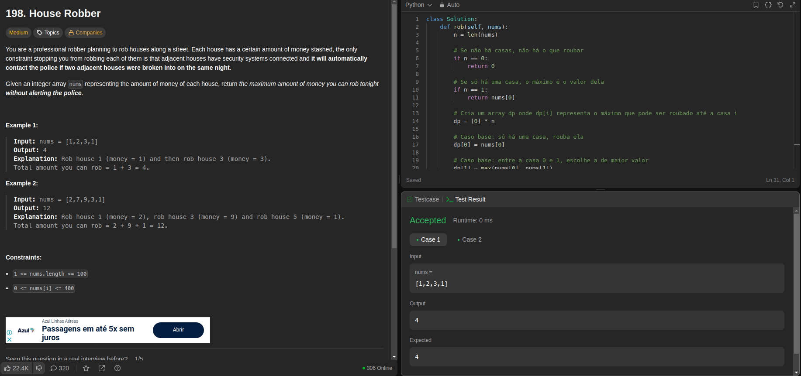
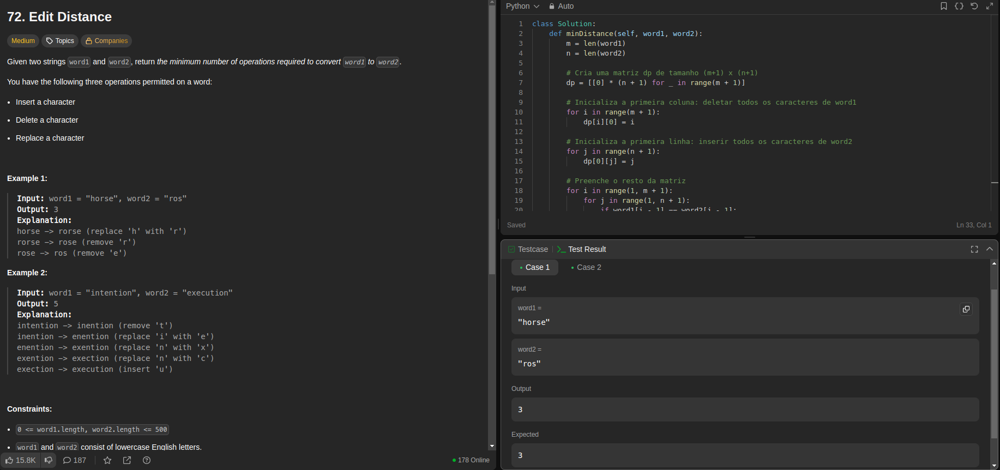
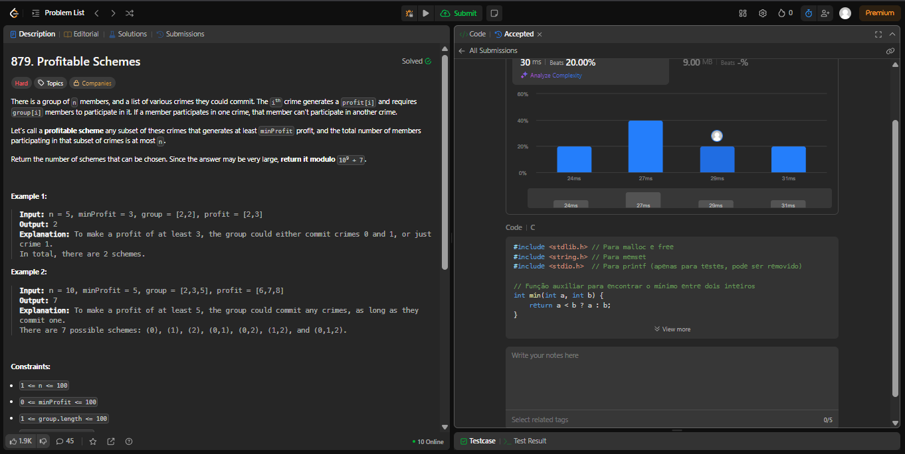
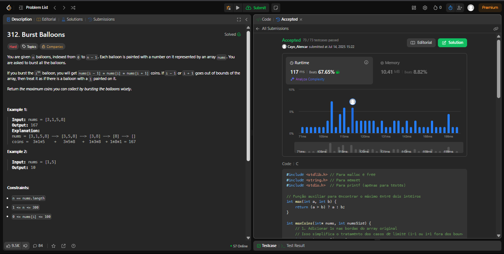

# PD__leet_code

**Número da Lista**: 5 
**Conteúdo da Disciplina**: Programação Dinâmica 

## Alunos
|Matrícula | Aluno |
| -- | -- |
| 22/1022506  |  Cayo Felipe Alencar Câmara |
| 19/0028963  |  Guilherme Brito de Souza |

## Sobre 
Foram realizadas 4 questões do leetcode e uma questão do Beecrowd sobre a abordagem Dividir e Conquistar.

| Problema | Nome                                   | Dificuldade |
|----------|----------------------------------------|-------------|
| [198](https://leetcode.com/problems/house-robber/)        |     House Robber                                  | Médio       |
| [72](https://leetcode.com/problems/edit-distance/)        |     Edit Distance                                 | Médio    |
| [312](https://leetcode.com/problems/burst-balloons/description/)        |   Burst Ballons                               | Difícil    |
| [879](https://leetcode.com/problems/profitable-schemes/description/)        |   Profitable Schemes                             | Difícil    |
| [741](https://leetcode.com/problems/cherry-pickup/description/)        |  Cherry Pickup                          | Difícil    |

       

## Screenshots

### Questão House Robber

### Questão Edit Distance

 ### Questão Profitable Schemes

 ### Questão Burst Ballons

 ### Questão Cherry Pickup

## Instalação 
**Linguagem**: Python 
**Linguagem**: C 

## Link

Link do vídeo do youtube:  [Vídeo das questões](https://youtu.be/Xz2y1iJ6zPM)
